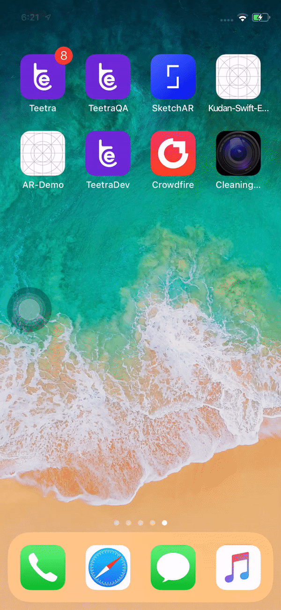

# CustomCamera

## Description

Using custom camera, 3rd party applications can open camera with desired UI and achieve the same functionality as internal camera do.

## Usage

Download project, or clone the repo.
Change UI(If needed as per your application need or theme)
Run the project.

## Features

- Anyone can customize UI as per their needs.

## Requirements

- iOS 9.0+
- Xcode 9.1+
- Swift 4.0+

## License

CustomCamera is available under the MIT license. [See LICENSE](https://github.com/TankarShah07/CustomCamera/blob/master/LICENSE) for details.
